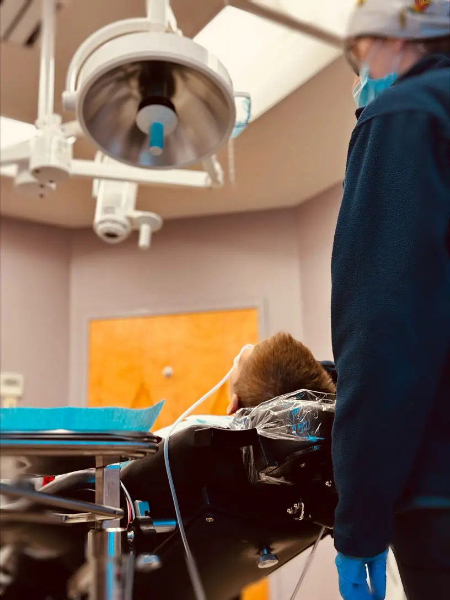

Sedation dentistry, also known as sleep dentistry or twilight dentistry, is a technique used to help patients feel relaxed and at ease during dental procedures. It involves the use of medication that induces a state of deep relaxation or even sleep, depending on the level of sedation required. At our dental office, all services that need IV sedation are rendered under the supervision of doctors specialized in providing IV sedation.

## Sedation Options

Sedation dentistry offers various levels of sedation to ensure that patients are comfortable and relaxed during their dental procedures. The different levels of sedation allow surgeons to cater to each patient's unique needs and anxiety levels.

**Nitrous Oxide**

The mildest form of sedation is nitrous oxide, also known as laughing gas. This level of sedation induces a feeling of euphoria and relaxation while allowing the patient to remain conscious and responsive throughout the procedure.

**Oral Sedatives**

Oral sedatives, such as anti-anxiety medications or tranquilizers, can be used for moderate sedation. These medications are taken orally before the appointment, allowing the effects to kick in by the time treatment begins. Patients will still be able to respond but may experience drowsiness or even fall asleep during the procedure.

**IV Sedation**

For more complex procedures or severe dental anxiety, intravenous (IV) sedation may be recommended. IV sedatives are administered directly into the bloodstream, inducing a state where most patients have little recollection of the procedure afterward.

## The Benefits of Sedation Dentistry

**Reduces Anxiety**

One of the biggest benefits of sedation dentistry is that it helps alleviate dental anxiety. Many people avoid seeing an oral surgeon due to fear or anxiety, but with sedation, they can relax and have a more comfortable experience.

**Pain Management**

Sedation dentistry allows for effective pain management during dental procedures. Whether it's a simple tooth extraction or a complex root canal, sedatives help numb the area and minimize discomfort.

**Time Efficiency**

With sedation dentistry, multiple procedures can be done in one appointment, saving time and reducing the number of visits required. This is especially beneficial for individuals with busy schedules or those who live far from their dental clinic.

**Improved Treatment Quality**

When patients are relaxed under sedation, dentists can work more efficiently without interruptions caused by patient discomfort or anxiety. This often leads to better treatment outcomes and improved overall oral health.

From reducing anxiety levels to improving treatment quality and efficiency, there are many benefits associated with opting for sedation dentistry.

## Dental Sedation FAQs

1. **Is It Safe for Children and Adults to Go to Sleep for Teeth Extractions?**
   Absolutely. Sleep dentistry, or sedation dentistry, is a safe and commonly used option for both children and adults undergoing dental procedures, including teeth extractions. It ensures a comfortable and anxiety-free experience while the dental team focuses on providing optimal care.

1. **Can Implants Be Done While Under Sedation or Sleep?**
   Yes, dental implants can be placed while the patient is under sedation or asleep. This approach is often chosen to enhance patient comfort, minimize anxiety, and allow for a more relaxed experience during the implant procedure. Our oral surgeon will discuss the appropriate sedation options based on your specific needs and the complexity of the procedure.

1. **I Am Scared of Needles; How Can I Be Put to Sleep for Dental Procedures?**
   We understand dental anxiety, especially when it comes to needles. Sedation dentistry offers various options, including oral sedatives and inhalation sedation (nitrous oxide or "laughing gas"). These alternatives can help you relax and alleviate fear without the need for traditional injections.

1. **I Have Multiple Medical Conditions; Can I Still Be Put to Sleep for Teeth Extractions?**
   Your overall health is a crucial consideration, and our experienced team will conduct a thorough medical evaluation to ensure your safety during sedation. In many cases, individuals with medical conditions can still undergo sedation for dental procedures. However, it's essential to discuss your medical history with our oral surgeon to determine the most suitable sedation approach for your specific situation.

1. **Can the Surgeon Put You to Sleep for Extractions or Implants?**
   Yes, both general dentists and oral surgeons can provide sedation options, including putting patients to sleep, for various dental procedures such as extractions or implant placement. However, the type of sedation offered may vary among practitioners. It's advisable to discuss your preferences and concerns with our surgeon to ensure the most appropriate and comfortable experience for your specific needs.

---

To learn more about the services we offer, visit Associated Oral & Maxillofacial Surgeons at one of our three convenient locations. You can find our Frederick dental office at 6550 Mercantile Drive E, Suite 101, Frederick, MD 21703, our Hagerstown dental office at 1144 Opal Court, Hagerstown, MD 21740, and our Martinsburg dental office at 1007 Sushruta Dr, Martinsburg, WV 25401. You can also call us for any queries at (301) 450-6717, (301) 507-0064, or (304) 577-5063, respectively.
